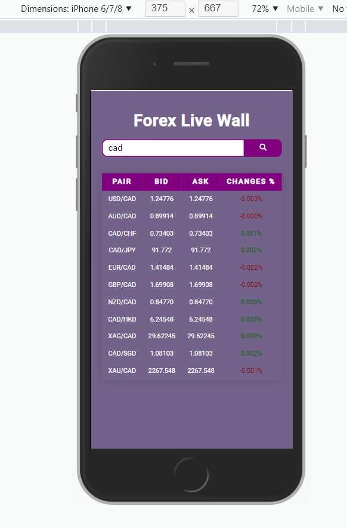
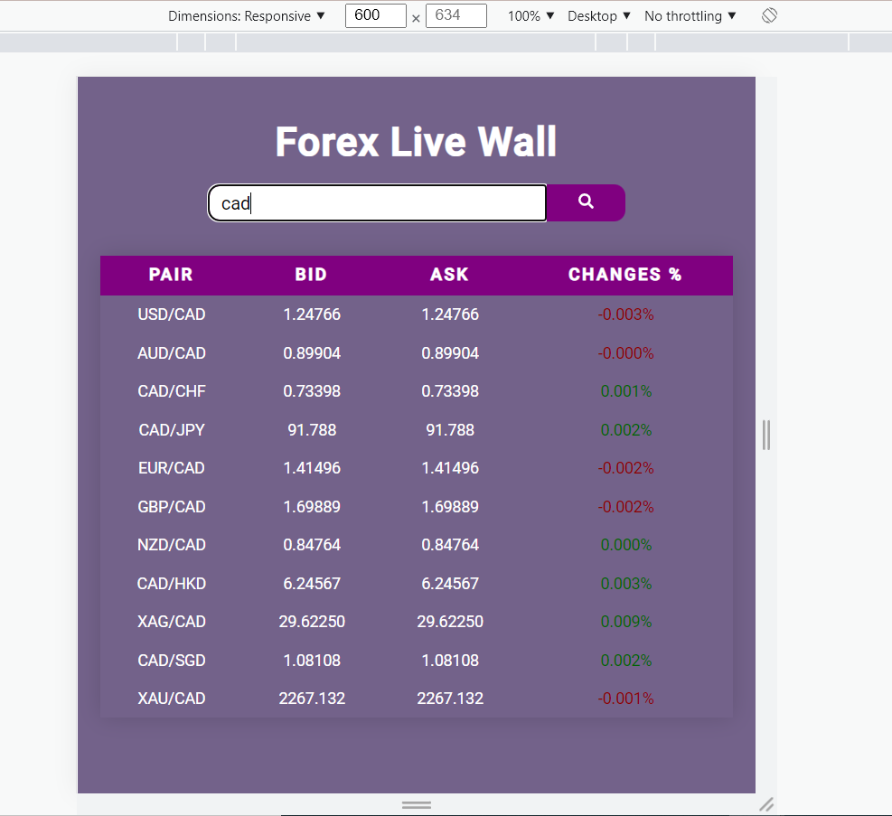
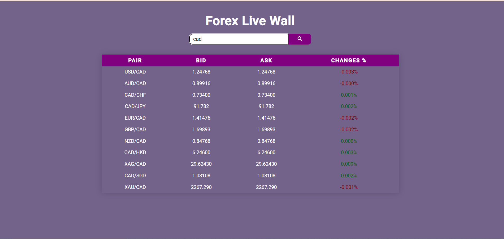

# Forex live page

---

## Project DEMO

https://forex-live-wall.netlify.app/

---

### Information about this project:

- React TypeScript single page application
- Responsive design

---

## Requirements

[HERE](./src/assets/Forex%20Live%20Wall.pdf)

---

## Install

    npm install

## Configure app

Open `src/pages/ForexLiveWall.tsx` then edit it with your settings. You will need:

- API_KEY;

## Running the project

    npm run start

## Test

    npm run test

Open [http://localhost:3000](http://localhost:3000) to view it in the browser.

---

